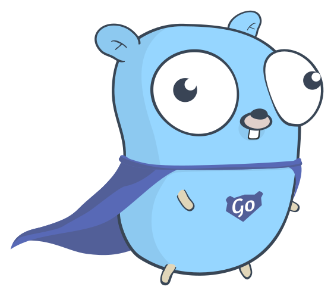

<p align="center">

</p>

## Project Structure
```
.
├── backend/
│   ├── src/
│   │   ├── auth/         # Authentication logic
│   │   ├── core/         # Core configurations
│   │   ├── flashcards/   # Flashcard related endpoints
│   │   ├── users/        # User management
│   │   └── main.py       # Application entry point
│   └── tests/            # Backend tests
└── frontend/
    ├── src/
    │   ├── components/   # Reusable UI components
    │   ├── hooks/        # Custom React hooks
    │   ├── routes/       # Application routes
    │   └── client/       # Generated API client
    └── public/           # Static assets
```

## Setup Instructions

### Backend Setup

1. Create a PostgreSQL database:
```bash
createdb <dbname>
```

2. Set up environment variables in `backend/.env`:
```env
PROJECT_NAME=FlashNotes
DOMAIN=localhost
POSTGRES_SERVER=localhost
POSTGRES_USER=<your-username>
POSTGRES_PASSWORD=<your-password>
POSTGRES_DB=<dbname>
FIRST_SUPERUSER=admin@example.com
FIRST_SUPERUSER_PASSWORD=<admin-password>
USERS_OPEN_REGISTRATION=true
```

3. Navigate to the backend directory:
```bash
cd backend
```

4. Make the prestart script executable:
```bash
chmod +x prestart.sh
```

5. Choose one of the following setup options:

#### Option 1: Quick Setup with uv
```bash
# Install dependencies and run migrations
uv run ./prestart.sh # Run ./prestart.sh to run db migrations

# Start the development server
uv run uvicorn src.main:app --reload
```

#### Option 2: Traditional Virtual Environment Setup
```bash
# Create and activate virtual environment
uv venv .venv
source .venv/bin/activate

# Install dependencies
uv sync

# Run migrations
./prestart.sh

# Start the development server
uvicorn src.main:app --reload
```

The backend server will be available at `http://127.0.0.1:8000`

### Frontend Setup

1. Install dependencies and start the development server:
```bash
cd frontend
pnpm install
pnpm run dev
```

### Generate Frontend API Client (Only if backend API is updated)

The frontend uses a generated TypeScript client to communicate with the backend API. To update the client after making changes to the backend:

1. Activate the backend virtual environment:
```bash
cd backend
source .venv/bin/activate  # For Unix/Linux
# OR
.venv\Scripts\activate     # For Windows
```

2. Run the client generation script from the project root:
```bash
./scripts/generate_client.sh
```

## API Documentation
Once the backend is running, access the interactive API documentation at:
- ReDoc: http://127.0.0.1:8000/redoc
- Swagger UI: http://127.0.0.1:8000/docs